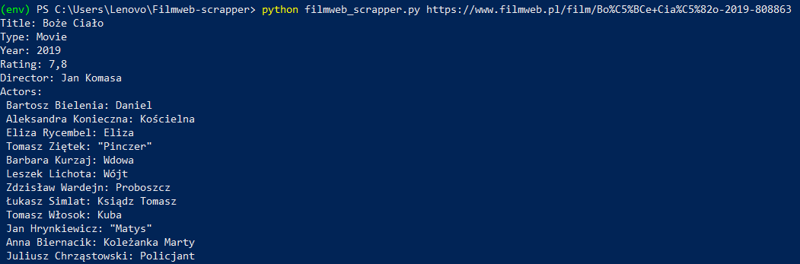

# Filmweb Scrapper

Basic web scrapper made with python and beautifulsoup4.


## Installation

Use the package manager pip to install Filmweb-scrapper
```bash
$ cd Filmweb-scrapper
$ python3 -m venv env
$ source env/bin/activate
$ pip install -r requirements.txt
```

## Demo


